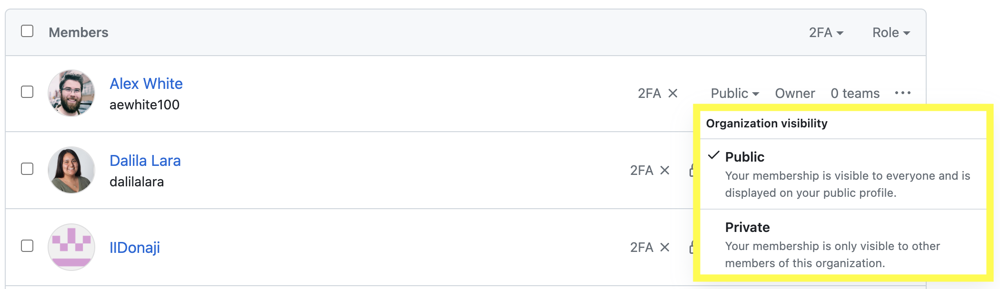
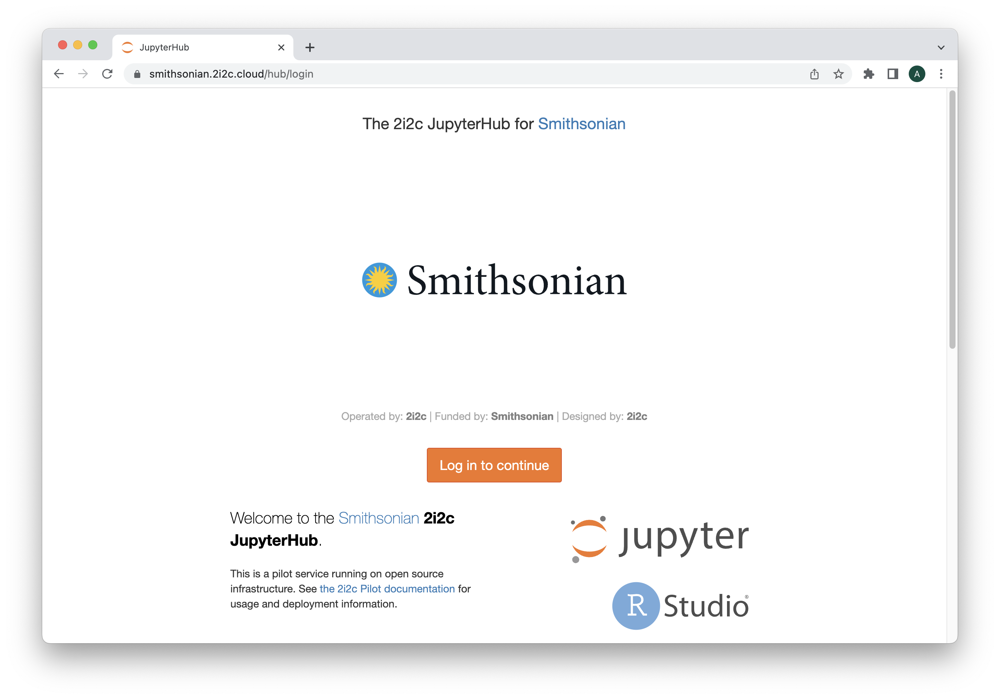
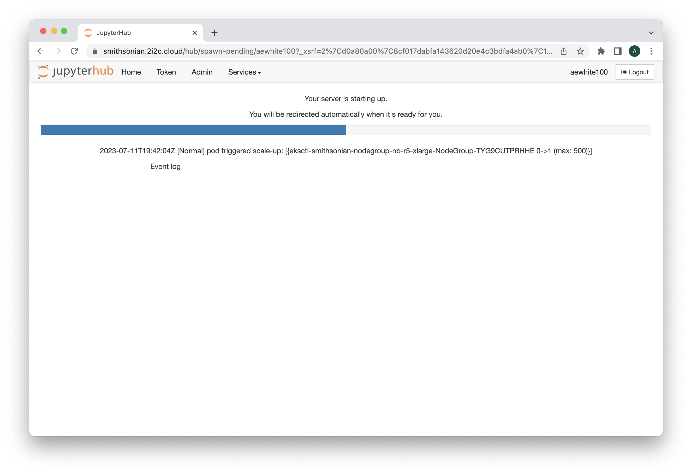
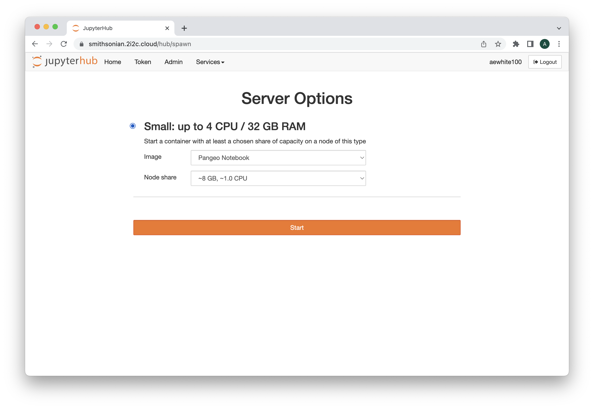
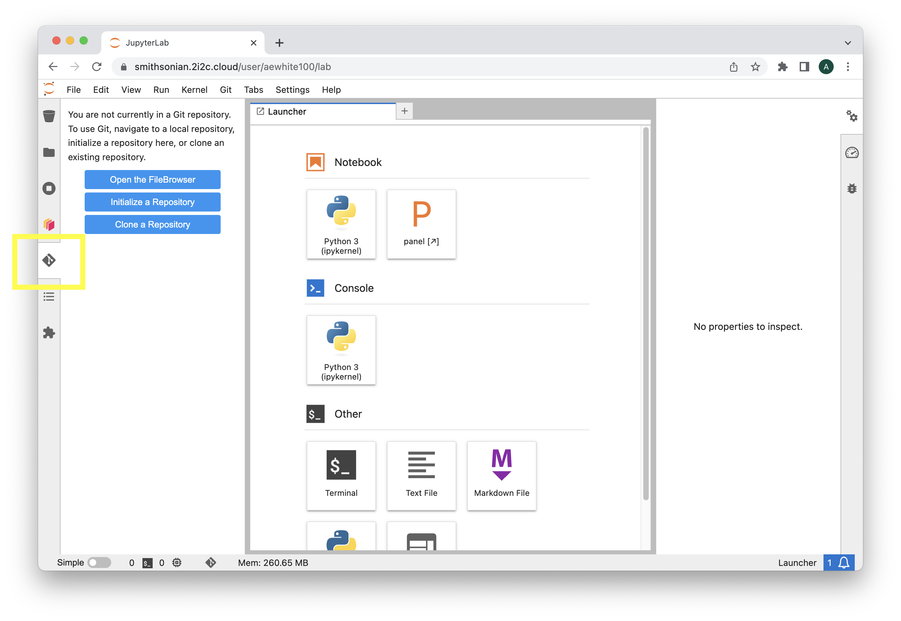
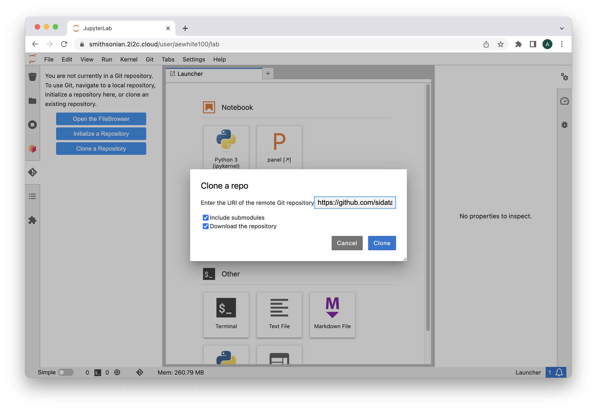
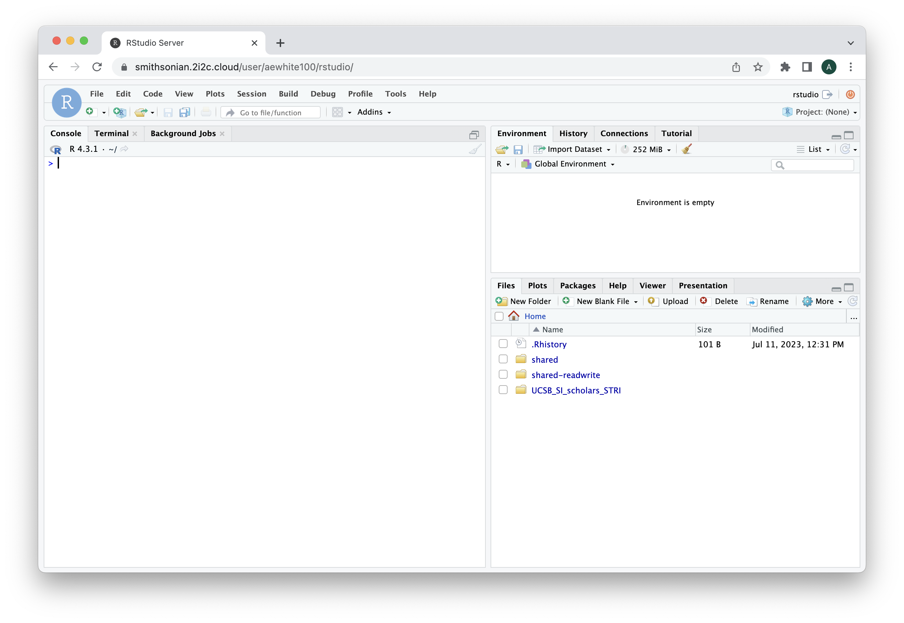

# Getting started

This course expects users to leverage the Smithsonian Data and Compute Hub (SDCH). Below, we discuss instructions for accessing SDCH followed by steps required to populate your SDCH user directory (your "persistent storage volume") with the course materials that are to be downloaded on GitHub.   

## Accessing SDCH

To access SDCH, you must be a member of the Smithsonian-SDCH github organization. Your instructor sent a membership invite to your github associated email address on July 10 2023. You also need to make sure your Smithsonian-SDCH organization membership is *public* to ultimately gain access to the SDCH portal. Follow these steps: 

1. Navigate to the [Smithsonian-SDCH people page](https://github.com/orgs/Smithsonian-SDCH/people).
2. Locate your name in the list of organization members.
3. On the right of your name, you will see a lock icon next to the word "Private".
4. Click the small down arrow to bring up the "Organization visibility" options and select "Public". See screenshot below.

Now you should be able to[:thread: :thread: click here to access SDCH :thread: :thread: ](https://smithsonian.2i2c.cloud/)

## Logging in

SDCH provides access to different types of computing resources - each of these is presented as a server "image". After selecting the appropriate image, users can select the computing power they require (the "node share").

A server image is akin to a computer with pre-installed drivers and resources for a particular purpose. For example, the `Rocker Geospatial` image provides and R Studio interface with pre-installed drivers to leverage R as a Geographic Information System (GIS). 

Once you select the proper resources you need (described in detail below), click start and the system will work to "acquire" those resources from our cloud-based computing cluster. You will observe a progress bar as the system works through this process.  

## Setting up your directory

1. First, you need to acquire the files necessary to work through the exercises for this course. Select the server image and node share as shown below and click start. 

2. Once your image is active, select the *git* icon on the left sidebar (see below)

3. Select "Clone a Repository", check the box next to "Download the repository" and in the blank text box type: `https://github.com/sidatasciencelab/UCSB_SI_scholars_STRI`

4. Click `Clone`. Cloning will download a new directory in your persistent storage entitled `UCSB_SI_scholars_STRI`. This will contain most of the files you need for our course. 

5. Navigate to the `File` and select `Hub Control Panel`. Click the red `Stop My Server` button, and finally select `-> Logout` in the top right of the screen.

## Working with R Studio

For the majority of the course, we will use R Studio. Select the `Rocker Geospatial` server image with 8 GB of RAM and 1 CPU of compute. Once logged in you will see the familiar R Studio interface with a file explorer in the bottom right containing the `UCSB_SI_scholars_STRI` directory we cloned earlier. From here, you should be all set up and ready to use R Studio as you would in any other setting. 

