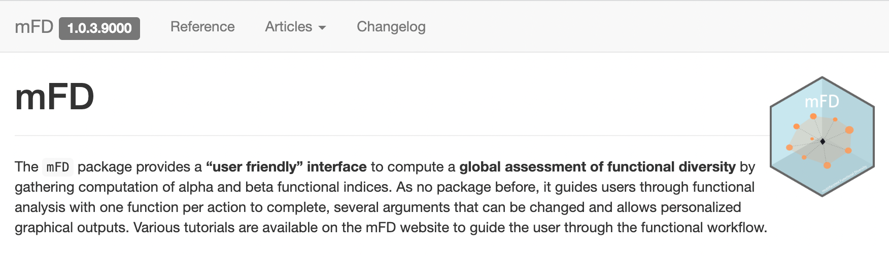
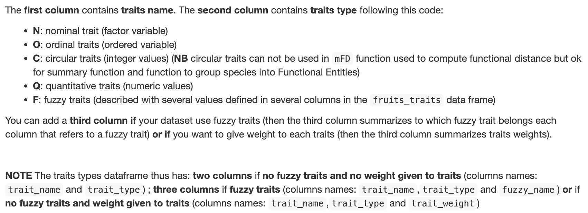
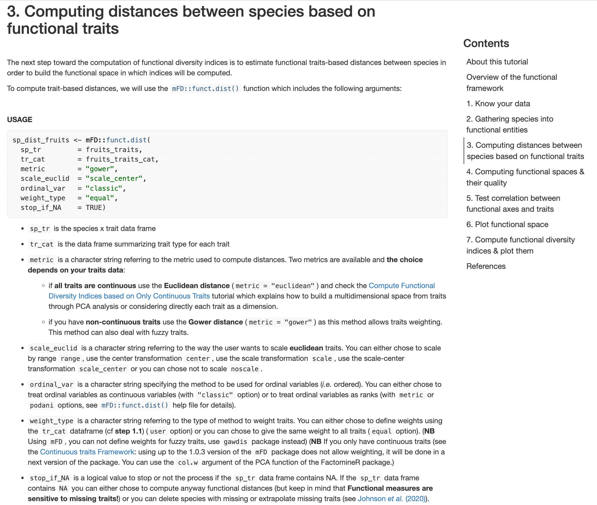
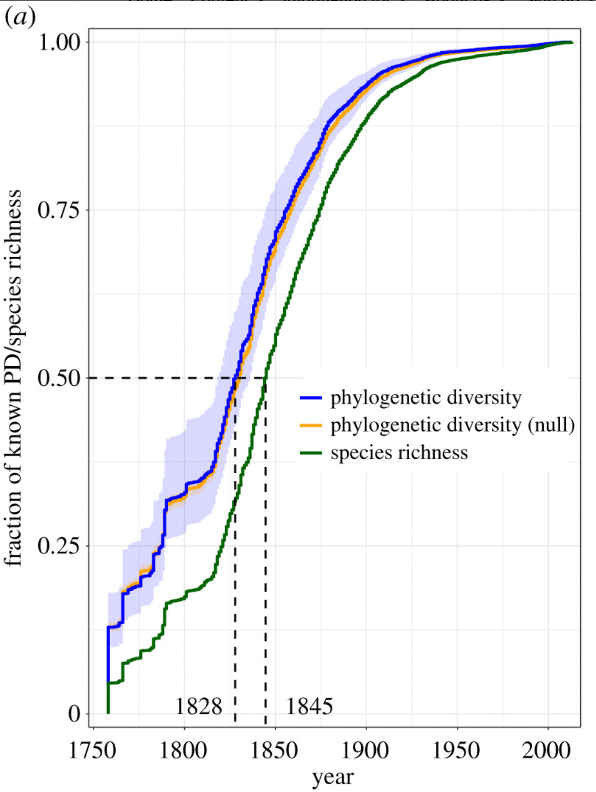

```{r, echo = FALSE}
knitr::opts_chunk$set(
  fig.path = "coffee_birds_figs/coffee_birds-"
)
```

```{r setup, message=FALSE, warnings=FALSE}
library(tidyverse)
library(ggplot2)
library(sf)
sf_use_s2(FALSE)
library(renv)
library(taxize)
```

## A game of names...

```{r}
coffee_birds <- read.csv("../data/coffee_Bird_Data.csv", stringsAsFactors = F)
glimpse(coffee_birds)
```

We downloaded the ebird taxonomy from the Cornell Lab of Ornithology [here](https://www.birds.cornell.edu/clementschecklist/download/?__hstc=60209138.ef3edea8ce1040824b180bde7f920a82.1687545990397.1687545990397.1689258046438.2&__hssc=60209138.2.1689258046438&__hsfp=1390145134&_gl=1*1kufgl6*_ga*MTk2MzQwNTE1MC4xNjg3NDU5NDQ4*_ga_QR4NVXZ8BM*MTY4OTI1ODA0Ni4zLjEuMTY4OTI1ODA4NS4yMS4wLjA.&_ga=2.109099270.241330988.1689258046-1963405150.1687459448). The .csv is available in the `/data` folder in the github repo.

```{r}
ebird_taxonomy <- read.csv("../data/ebird_taxonomy_v2022.csv", stringsAsFactors = F)
glimpse(ebird_taxonomy)
```

```{r}
coffee_joined <- left_join(coffee_birds, ebird_taxonomy, by = join_by(Common_Name == PRIMARY_COM_NAME))
head(coffee_joined)
```

```{r}
coffee_species <- coffee_joined %>% filter(CATEGORY == "species") %>% filter(distance_band == "within") %>% filter(!Point_Name == "1-651 Callejón Seco, Los Naranjos, Provincia de Chiriquí, PA (8.818, -82.481)")
```

We could also use a more generalized R package `taxize` to standardize the common names to latin species epithets ("genus_species"). We won't develop this method but the beginnings of this approach are shown below.

```{r}
common_names <- coffee_birds %>% distinct(Common_Name)
common_names <- as.vector(common_names$Common_Name)
uid <- get_tsn(common_names[1:3], searchtype = "common", accepted = TRUE)
```

## Quantifying biodiversity

The goal of this exercise is to better understand how scientists quantify metrics of biodiversity and how those metrics are used to both make decisions in conservation and to understand fundamental processes of biology. Below we will work with the bird coffee dataset to quantify various metrics of diversity for different study plots in the coffee dataset, and to understand how values of diversity changes depending on what species features we select to represent biological diversity.

### Taxonomic richness

Perhaps the simplest metric of biodiversity is taxonomic richness, or the number of individual taxonomic groups represented at the study location. Taxonomic groups can represent any taxonomic rank in the Linnaean taxonomic system (e.g., order, family, genus, species), and depending on the study, difference ranks are used as a unit of richness. All of the species in our dataset are birds, and so they are all in the same class *Aves*. The taxonomic rank in our dataset is mostly at the level of species, so it makes good sense to quantify and compare *species richness* across our sites.

First we need to understand how many points are surveyed in our data.

```{r}
point_names <- coffee_species %>% 
  distinct(Point_Name)
point_names <- as.vector(point_names$Point_Name)
length(point_names)
dim(coffee_species)
```

There are 5086 observations in 129 different locations in our dataset. Our goal is to count the number of unique species in each location. One *could* try to just count the unique number of observations per location. Does this reflect the quantity we are trying to estimate?

```{r}
species_richness <- coffee_species %>% count(Point_Name)
#species_richness
```


### For loops

Let's try something a bit more sophisticated. Digging deeper, it appears that these observations were collected on different days. The same species could be recorded multiple times per location. We need to approach the problem systematically. We can use a powerful tool called a `for` loop.

-   Loops are the fundamental structure for repetition in programming
-   `for` loops perform the same action for each item in a list of things

```         
for (item in list_of_items) {
  do_something(item)
}
```

In this case we want to build a `for` loop that loops over each location in our dataset and counts the number of unique species detected in that location. Following the template above we build our `for` loops as follows:

```{r}
for (place in point_names){ #start the for loop
  
  sp_rich <- coffee_species %>% # grab our original dataset
    filter(Point_Name == place) %>% # filter the dataset for each point name
    distinct(SCI_NAME) # select the distinct species names
  
  sp <- length(as.vector(sp_rich$SCI_NAME)) # generate a vector of the species names and provide the length of that vector
  
  #print(sp) # print the value of species richness
}
```

There is one obvious problem with the loop we've created - the results are merely printed. We need to store the results in an object (likely a vector), and we need to modify out loop in order to do that efficiently.

### Looping with an index & storing results

R loops iterate over a series of values in a vector or other list like object. When we use that value directly this is called looping by value. But there is another way to loop, which is called looping by index. Looping by index loops over a list of integer index values, typically starting at 1. These integers are then used to access values in one or more vectors at the position indicated by the index.

We often use `i` to stand for "index" as the variable we update with each step through the loop.

If we modified our previous loop to use an index it would look like this:

```{r}
for (i in 1:length(point_names)){ #start the for loop
  
  sp_rich <- coffee_species %>% # grab our original dataset
    filter(Point_Name == i) %>% # filter the dataset for each point name
    distinct(SCI_NAME) # select the distinct species names
  
  sp <- length(as.vector(sp_rich$SCI_NAME)) # generate a vector of the species names and provide the length of that vector
  
  #print(sp) # print the value of species richness
}
```

Here we still need to add a method to store the results. To do this we start by creating an empty object the same length as the results will be before the loop starts. To store results in a vector we use the function `vector` to create an empty vector of the right length. `mode` is the type of data we are going to store. `length` is the length of the vector.

```{r}
sp <- vector(mode = "numeric", length = length(point_names))
```

Then add each result in the right position in the `sp` vector. For each trip through the loop put the output into the empty vector at the `i`th position.

```{r}
for (i in 1:length(point_names)){ #start the for loop
  
  sp_rich <- coffee_species %>% # grab our original dataset
    filter(Point_Name == point_names[i]) %>% # filter the dataset for each point name
    distinct(SCI_NAME) # select the distinct species names
  
  sp[i] <- length(as.vector(sp_rich$SCI_NAME)) # generate a vector of the species names and provide the length of that vector
  
}
sp  # print the value of species richness
```

Now that we've built the loop and saved the output, we need to combine these data with our original dataset to pair the calculated metric `sp` with the `point_names`. But because there are a number of other variables that have also been measured for each point and we expect to add more moving forward, let's combine the `sp` vector with a larger metadata table.

```{r}
point_metadata <- read.csv("../data/point_metadata.csv", stringsAsFactors = F)
head(point_metadata)
```

We know our `sp` vector is ordered according to the `point_names` vector. Let's bind those together in a dataframe and join that with the `point_metadata` table above. First generate the dataframe:

```{r}
sp_richness <- data.frame(sp, point_names)
head(sp_richness)
```

Now we can use `left_join()` with the `point_metadata` table to aggregate our metadata in a single table:

```{r}
point_metadata <- left_join(point_metadata, sp_richness, by = join_by(Name_Point == point_names))
head(point_metadata)
```

Voila! Now we can easily use the `point_metadata` table to analyze and visualize the relationships between the various metrics we are interested in! How does the habitat type (sun vs. shade) relate to the number of species at the point? How does canopy cover play a role? How do we quantify those effects? While it seemed trivial at first to count the species in each point, we have now developed a programmatic approach that we can modify to generate other metrics of diversity that go beyond mere species counts.

### Functional richness

Counting species is one way to measure the diversity of an ecosystem, but species may or may not be the appropriate unit of measurement for a particular research question or conservation decision. For example, biologists may consider how species interact with their environments and instead look to count how different types of interactions are represented by the species that they observe. In this framework, 2 species may share the exact same traits that govern their interactions with the environment, and so while 2 species may be counted from a taxonomic richness point of view only 1 *functional group* would be counted from a *functional richness* perspective.

One of the most important functional traits for bird species is the size and shape of their bill. The bill is the main anatomical feature that birds use to interact with their environment and bill traits combined with the overall size of a species can tell biologists a lot about what a bird does in an ecosystem.

![**Morphological diversity of bird bills.** Top row (left to right): *Aethopyga gouldiae, Napothera malacoptila, Harpactes erythrocephalus, Cissa chinensis, Fratercula corniculata*. Second row (left to right): *Passer cinnamomeus, Aquila nipalensis, Anastomus oscitans, Serilophus lunatus, Phoenicopterus roseus.* Third row (left to right): *Recurvirostra avosetta, Corvus corax, Spilornis cheela, Chalcophaps indica, Thalassarche cauta.* Fourth row (left to right): *Ara ararauna, Phyllergates cucullatus, Paradoxornis flavirostris, Stachyris humei, Batrachostomus moniliger.* Bottom left: *Platalea leucorodia*. Fifth row (left to right): *Pomatorhinus ferruginosus, Pyrrhoplectes epauletta, Nestor notabilis.* Sixth row (left to right): *Pomatorhinus superciliaris, Diomedea epomophora, Upupa epops, Gallus gallus*. Bottom right: *Pelecanus philippensis*](../images/bird-bills.png)

#### Merging traits with surveys

For most of the history of modern science, the only way to measure a birds bill was to have the bird in hand. This was achieved either by capturing a live bird (often using a mist net) or by collecting a bird as a specimen to be kept in a natural history collection. The Division of Birds at Smithsonian National Museum of Natural History contains ~640,000 individual bird specimens, representing the 3rd largest bird collection in the world.   


But thanks to the efforts of biologists working with both these collections and with wild caught individuals in remote locations, trait data are now available in a publicly accessible dataset comprising most of the worlds bird species. These data were meticulously compiled using caliper measurements of traits from multiple specimens per species, and so can provide us an estimate of the functional traits of any bird species we encounter. Similar datasets are being generated for mammals, some plant groups, fossil species; the list goes on. These data provide us with the foundation for quantitative ecological studies of the relationship between traits and the environment. We can also ask how those traits evolved by combining trait data with DNA sequence data. These datasets are the modern basis for investigating fundamental questions in ecology and evolution.

The bird species dataset is named AVONET; it is described in the following paper:

```
Tobias, Joseph A., et al. "AVONET: morphological, ecological and geographical data for all birds." Ecology Letters 25.3 (2022): 581-597. https://doi.org/10.1111/ele.13898

@article{tobias2022avonet,
  title={AVONET: morphological, ecological and geographical data for all birds},
  author={Tobias, Joseph A and Sheard, Catherine and Pigot, Alex L and Devenish, Adam JM and Yang, Jingyi and Sayol, Ferran and Neate-Clegg, Montague HC and Alioravainen, Nico and Weeks, Thomas L and Barber, Robert A and others},
  journal={Ecology Letters},
  volume={25},
  number={3},
  pages={581--597},
  year={2022},
  publisher={Wiley Online Library}
}
```
&emsp; &emsp; [Link to Tobias et al. 2022](https://onlinelibrary.wiley.com/doi/full/10.1111/ele.13898)

&emsp; &emsp; [Link to data from Tobias et al. 2022](https://figshare.com/s/b990722d72a26b5bfead) - these data are already in the `/data` directory in the course repo. 

To get a full picture of the functional diversity contained in our Panamanian coffee dataset, let's extract trait data from AVONET for the species observed in the coffee plantations. 
First read in the data.

```{r}
avonet <- read.csv("../data/AVONET_ebird.csv", stringsAsFactors = F)
glimpse(avonet)
```

There are numerous ways to quantify functional diversity from trait measurements. Some methods incorporate only quantitative variables and some methods incorporate categorical data like `Habitat` and `Trophic.niche` by converting those variables to binomial characters `[0,1]`. Many of these methods are rooted in a distance-based approach, meaning that a (often euclidean) multidimensional space is computed containing all species in the dataset, and diversity is measured as the overall space occupied by those species in the multidimensional space. This means that computing *functional richness* usually requires a few steps. 

* What traits are included in the trait space?
* How will you generate the numerical space to measure distance?
* How will you measure occupancy and distance within that numerical space?

Ecologists have been investigating these choices and how they influence our understanding of a biological system for decades. Magneville et al. (2022) provide R based methods for computing across many of these choices is their new package `mFD`. 


While the paper is comprehensive, many R packages are now supplied with a useful [website](https://cmlmagneville.github.io/mFD/). The best way to deploy a new approach like this is to use the website as a "recipe book" so to speak. Let's navigate to the website and compute some functional diversity metrics for our bird surveys. 


First, we (most likely) need to install the package. Use the `install.packages()` function.
```
# Install stable version of < mFD > from CRAN ----
install.packages("mFD")
```

```{r}
library(mFD)
```

From the package website:

*To compute functional diversity indices, users need:

* a data frame summarizing species traits (species in rows, traits in columns). The mFD package works with all kind of traits: quantitative, ordinal, nominal, circular, and fuzzy-coded.

* a matrix summarizing species gathering into assemblages (assemblages in rows, species in columns). All assemblages must at least contain one species.

* a data frame summarizing traits category (first column with traits name, second column with traits type, third column with fuzzy name of fuzzy traits - if no fuzzy traits: NA).

For a complete understanding of the functional workflow and the package possibilities, please refer to the [mFD General Workflow](https://cmlmagneville.github.io/mFD/articles/mFD_general_workflow.html)*.

Exercise:
How do we transform our data from single observations of species in each point (our current `coffee_species` data) into the a matrix of points (or assemblages) in rows and the count of each species in the column? For simplicity, let's just count the species as present or absent using `[0,1]`. Try building a `for` loop, but first start with a matrix of points and species. Fill in the matrix programatically using a loop.

```{r}
species_names <- coffee_species %>%
    distinct(SCI_NAME)

coffee_points <- matrix(data = NA, 
                        nrow = length(point_names), 
                        ncol = length(species_names$SCI_NAME))

colnames(coffee_points) <- species_names$SCI_NAME
rownames(coffee_points) <- point_names
```

We can grab our loop that we used before and modify it for our new objective.

```{r}
for (i in 1:length(point_names)){ #start the for loop
  
  sp_rich <- coffee_species %>% # grab our original dataset
    filter(Point_Name == point_names[i]) %>% # filter the dataset for each point name
    distinct(SCI_NAME) # select the distinct species names
  
  pres_ab <- colnames(coffee_points) %in% sp_rich$SCI_NAME # generate a vector of the species names and provide the length of that vector
  
  coffee_points[i,] <- as.numeric(pres_ab)
}
```

OK! Now we are moving closer to leveraging the `mFD` package. The final piece is a dataframe telling the package what types of traits we are using. There are many traits to choose from in the AVONET dataset, and therefore many potential ways to view functional richness. Let's choose which functional traits we are going to use for this analysis. 

```{r}
glimpse(avonet)
```
```{r}
trait_name <- colnames(avonet)[c(10:17,19,20,26,27,29:31)]
```

Now that we have our traits we need to follow the `mFD` recipe for building our trait type dataframe:

Our data are quantitative, nominal, and in the case of Habitat.density, this seems like an ordinal variable. We can build a `bird_trait_type` dataframe using these two vectors.

```{r}
trait_type <- c(rep("Q",10),"N","Q",rep("N",3))
bird_trait_type <- data.frame(trait_name, trait_type)
```

Finally, we need to filter AVONET to only include the species we need for our analysis. We already have a vector `colnames(coffee_points)` so let's filter AVONET using that vector. 

```{r}
avonet_coffee <- avonet %>% filter(Species2 %in% colnames(coffee_points))
length(colnames(coffee_points))
dim(avonet_coffee)
```

It seems that we've lost 2 species from our coffee dataset - which species are missing?

```{r}
colnames(coffee_points)[!colnames(coffee_points) %in% avonet_coffee$Species2]
```

This is a very common problem when working with these types of data. The taxonomy of all organisms is under constant revision and species names change all the time. Out two missing species are `"Mionectes galbinus"` and `"Daptrius chimachima"`. A quick search reveals other possible species names that may be used in the AVONET dataset `"Mionectes olivaceus"` and `"Milvago chimachima"`. Let's modify our original dataset to reflect these changes.  

```{r}
colnames(coffee_points)[colnames(coffee_points) == "Mionectes galbinus"] <- "Mionectes olivaceus"
colnames(coffee_points)[colnames(coffee_points) == "Daptrius chimachima"] <- "Milvago chimachima"
```

Now re-filter AVONET using the full complement of species names. One snag seems to be that the datasframe requires all strings to be factors, so we rebuild our dataframe using that argument. 

```{r}
avonet_coffee <- avonet %>% filter(Species2 %in% colnames(coffee_points))
avonet_coffee <- as.data.frame(unclass(avonet_coffee),
                               row.names = avonet_coffee$Species2, 
                               stringsAsFactors = TRUE)
avonet_coffee <- avonet_coffee %>% select(all_of(trait_name))
```

Finally we can use mFD! As we noted earlier, there are many things to consider when computing functional richness. From the `mFD` general workflow [vignette](https://cmlmagneville.github.io/mFD/articles/mFD_general_workflow.html#computing-distances-between-species-based-on-functional-traits), we need to compute the distances between species in our functional trait space. From this space, we will compute functional richness of our points.  


```{r}
sp_dist_birds <- mFD::funct.dist(
  sp_tr         = avonet_coffee,
  tr_cat        = bird_trait_type,
  metric        = "gower",
  scale_euclid  = "scale_center",
  ordinal_var   = "classic",
  weight_type   = "equal",
  stop_if_NA    = TRUE)
```


```{r}
fspaces_quality_birds <- mFD::quality.fspaces(
  sp_dist             = sp_dist_birds,
  maxdim_pcoa         = 10,
  deviation_weighting = "absolute",
  fdist_scaling       = FALSE,
  fdendro             = "average")
```

```{r}
sp_faxes_coord_birds <- fspaces_quality_birds$"details_fspaces"$"sp_pc_coord"
```

```{r, message=FALSE}
alpha_fd_indices_birds <- mFD::alpha.fd.multidim(
  sp_faxes_coord   = sp_faxes_coord_birds[ , c("PC1", "PC2")],
  asb_sp_w         = coffee_points,
  ind_vect         = c("fdis", "fmpd", "fnnd", "feve", "fric", "fdiv", "fori", 
                       "fspe", "fide"),
  scaling          = TRUE,
  check_input      = TRUE,
  details_returned = TRUE)
```

```{r}
fd_ind_values_birds <- alpha_fd_indices_birds$"functional_diversity_indices"
fd_ind_values_birds$point_name <- rownames(fd_ind_values_birds)
```


```{r}
point_metadata <- left_join(point_metadata, fd_ind_values_birds, by = join_by(Name_Point == point_name))
glimpse(point_metadata)
```

### Phylogenetic richness

We have now described our data in two ecologically relevant ways. The first is by species richness, and the second an estimate of how those species represent different ecological units in the community. From a conservation perspective, the species themselves are really representations of ecological function but also evolutionary distinction. Species names don't neccesarily tell us the evolutionary uniqueness of the community, but we can use methods from phylogenetics to assess phylogenetic diversity using evolutionary or phylogenetic trees.

While a number of phylogenetic trees have been published, we will make use of a tree that was recently assembled to make use of the most modern interpretation of 5 previously published trees. Methods to assemble these data into a consensus tree are found [here](http://blog.phytools.org/2016/04/consensus-methods-and-computing-average.html)

&emsp; &emsp; [Link to Lum et al. 2022](https://royalsocietypublishing.org/doi/10.1098/rspb.2022.0088)  

&emsp; &emsp; [Link to data from Lum et al. 2022](https://doi.org/10.6084/m9.figshare.c.5923562.v1)  

As a quick aside, these data come from a paper that sought to summarize the accumulation of phylogenetic diversity over time since Linnaean taxonomy (e.g., genus_species) was introduced 1758. 50% of known PD for birds was already described by ~1828. 



Measuring phylogenetic diversity by summing unique branches in each phylogentic tree. 

```{r, messages = F}
install.packages("phytools")
library(phytools)
```

The first problem we have is that the names in our phylogenetic tree are different than the names in our dataset. Each uses a different global bird taxonomy. This is such a common problem that I have never once encountered an analysis where the names matched arcoss global datasets. Luckily, many lists provide a comparison between their names and the names used by others. We will match the species names in our dataset with those in the phylogeny by using a dataset of these comparisons found [here](https://www.worldbirdnames.org/new/ioc-lists/master-list-2/). 

```{r}
ioc_taxonomy <- read.csv("../data/IOC_13.2_vs_other_lists.csv", stringsAsFactors = F)

ioc_taxonomy <- ioc_taxonomy %>% filter(Rank == "species")

ebird_to_HM_taxonomy <- ioc_taxonomy[,c(6,9)]

ebird_to_HM_taxonomy[ebird_to_HM_taxonomy[,1] == "",1] <- NA
ebird_to_HM_taxonomy[ebird_to_HM_taxonomy[,2] == "",2] <- NA
ebird_to_HM_taxonomy <- na.omit(ebird_to_HM_taxonomy)

colnames(ebird_to_HM_taxonomy) <- c("ebird", "hm")

ebird_to_HM_taxonomy$ebird <- sub(" ","_",ebird_to_HM_taxonomy$ebird)
ebird_to_HM_taxonomy$hm <- sub(" ","_",ebird_to_HM_taxonomy$hm)

species <- sub(" ","_",species_names$SCI_NAME)
```


```{r}
files <- list.files(path="../data/final_merged_trees", pattern="*.tre", full.names=TRUE, recursive=FALSE)
phy_birds <- list()
pd <- c()
for (i in 1:length(files)){
  phy_bird_tree <- read.tree(files[[i]])
  
  phy_bird_tree$tip.label <- plyr::mapvalues(phy_bird_tree$tip.label,
                                             from = ebird_to_HM_taxonomy$hm, 
                                             to = ebird_to_HM_taxonomy$ebird,
                                             warn_missing = F)
  
  phy_bird_tree = bind.tip(phy_bird_tree, "temp_edge", edge.length = 0, position = 0)
  
  removals <- phy_bird_tree$tip.label[!phy_bird_tree$tip.label %in% species]
  
  phy_birds[[i]] = drop.tip(phy_bird_tree, removals)

}

class(phy_birds) <- "multiPhylo"
```

```{r}
#avg_phy_birds <- averageTree(phy_birds, start=NULL, method="quadratic.path.difference")

pd_mat <- matrix(nrow = length(phy_birds), 
                 ncol = length(point_names))

for (i in 1:length(point_names)){ #start the for loop
  
  tips <- coffee_species %>% # grab our original dataset
    filter(Point_Name == point_names[i]) %>% # filter the dataset for each point name
    distinct(SCI_NAME)
  
  tips <- sub(" ","_",tips$SCI_NAME)
  
  branch_length <- c()             
  for (z in 1:length(phy_birds)){
    
      removals <- phy_birds[[i]]$tip.label[!phy_birds[[i]]$tip.label %in% tips]
      
      loca_phy = drop.tip(phy_birds[[i]], removals)
      
      branch_length[z] <- sum(loca_phy$edge.length)
  }
  pd_mat[,i] <- branch_length
  
  #print(i)
}
```

```{r}
mean_pd <- apply(pd_mat, 2, mean)
```


# Appendix

Exercises from <https://datacarpentry.org/semester-biology/exercises/Loops-basic-for-loops-R/>

## Basic For Loops (Loops)

Exercises from <https://datacarpentry.org/semester-biology/exercises/Loops-basic-for-loops-R/>

1.  The code below prints the numbers 1 through 5 one line at a time. Modify it to print each of these numbers multiplied by 3.

```         
numbers <- c(1, 2, 3, 4, 5)
for (number in numbers){
  print(number)
}
```

2.  Write a for loop that loops over the following vector and prints out the mass in kilograms (mass_kg = 2.2 \* mass_lb)

```         
mass_lbs <- c(2.2, 3.5, 9.6, 1.2)
```

3.  Complete the code below so that it prints out the name of each bird one line at a time.

```         
birds = c('robin', 'woodpecker', 'blue jay', 'sparrow')
for (i in 1:length(_________)){
  print(birds[__])
}
```

4.  Complete the code below so that it stores one area for each radius.

```         
radius <- c(1.3, 2.1, 3.5)
areas <- vector(_____ = "numeric", length = ______)
for (__ in 1:length(________)){
  areas[__] <- pi * radius[i] ^ 2
}
areas
```

5.  Complete the code below to calculate an area for each pair of lengths and widths, store the areas in a vector, and after they are all calculated print them out:

```         
lengths = c(1.1, 2.2, 1.6)
widths = c(3.5, 2.4, 2.8)
areas <- vector(length = __________)
for (i in _____) {
  areas[__] <- lengths[__] * widths[__]
}
areas
```
